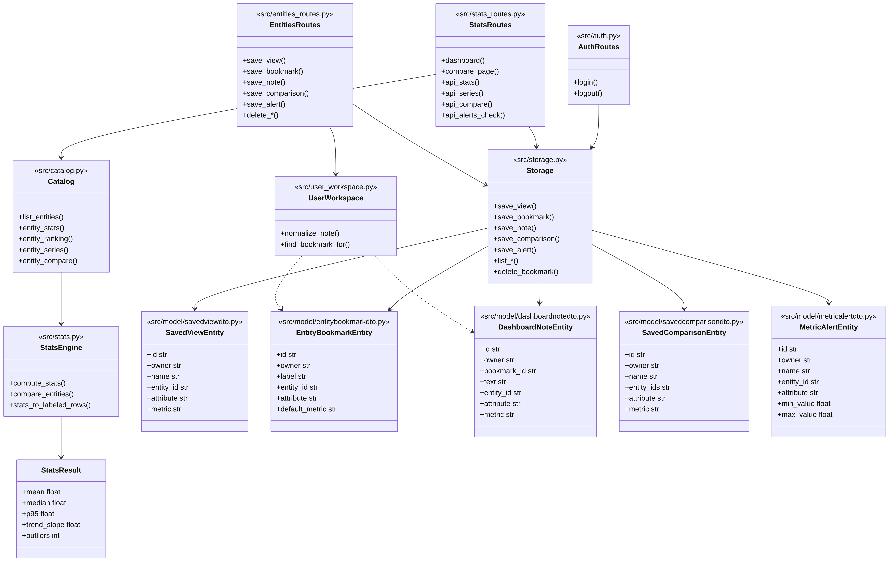
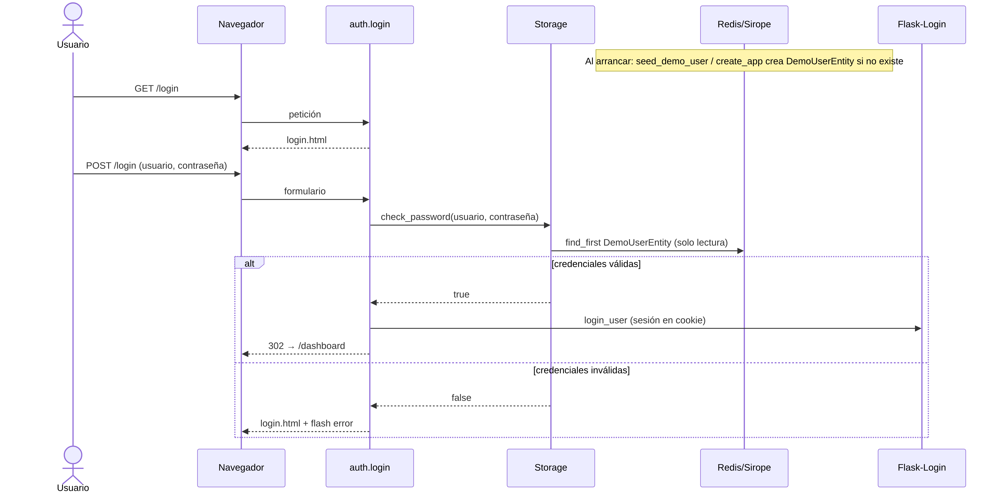
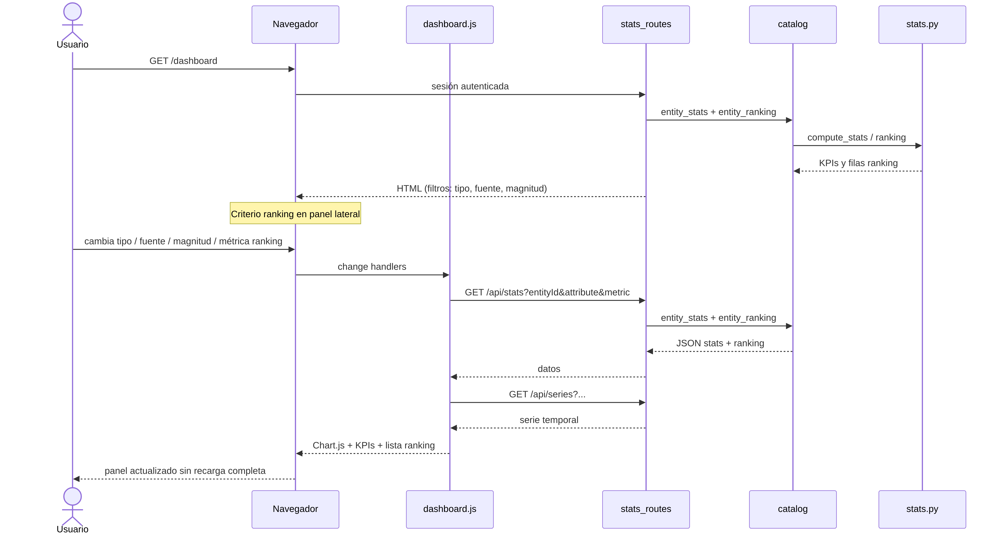
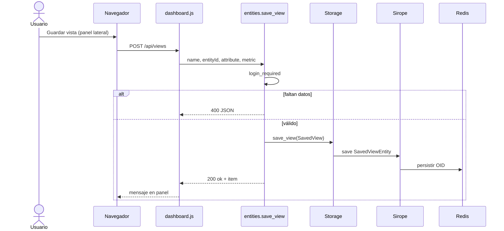

# Memoria — Nagasaki Analytics

**Asignatura:** ALS  
**Título:** Nagasaki Analytics — Consola de analítica IoT  
**Autor:** Julio Pérez García

---

## 1. Introducción

Nagasaki Analytics es una aplicación web para consultar estadísticas sobre series temporales de dispositivos simulados: plantas solares y sensores de tráfico. El usuario puede ver gráficas, comparar varios dispositivos a la vez y guardar consultas, marcadores y notas.

La implementación usa Flask con plantillas Jinja2, Flask-Login para la sesión y Sirope sobre Redis para persistir **cinco entidades de dominio** (sin contar el usuario). El catálogo de datos y el cálculo de estadísticas van integrados en la propia aplicación; no hace falta levantar otros servicios para usarla.

### Relación con el TFG

A la vez que hago esta práctica de ALS, estoy desarrollando un TFG llamado *Nagasaki*. La idea del TFG es montar una plataforma para recoger y consultar datos de sensores urbanos: producción de plantas solares, lecturas de tráfico, ese tipo de cosas. Lo he dividido en varios proyectos (backend, frontend, predicción, simulador…) y este sería el panel donde alguien mira las series y saca conclusiones.

Nagasaki Analytics no administra la plataforma entera ni hace predicciones. Se centra en analítica descriptiva: medias, percentiles, ranking entre dispositivos, comparativas en gráfico de barras, etc. Para la entrega de ALS lo he dejado autocontenido: los datos están en `src/data/demo_seed.json` y no depende del backend del TFG. Los identificadores de los dispositivos (`urn:nagasaki:solar:plant-1`, por ejemplo) son los mismos que uso en el resto del trabajo para no mezclar convenciones, pero aquí son solo datos locales.

## 2. Objetivos

Quería conseguir un panel que se lanzara con **Docker Compose** (Redis y la aplicación Flask en un solo comando), calculara indicadores útiles sobre las series (media, mediana, P95, tendencia, cobertura, outliers) y mostrara todo en castellano, con gráficas legibles. También que el usuario pudiera guardar su trabajo sin depender de otro servicio del TFG.

## 3. Despliegue y arquitectura

### 3.1 Arranque con Docker Compose

Desde la raíz del proyecto (`nagasaki-stats-ui`):

```bash
docker compose up --build
```

Ese único comando levanta **Redis** (persistencia Sirope en volumen Docker `redis-data`) y la **aplicación web** Flask. No hace falta instalar Python ni Redis en el host. Al arrancar el contenedor, `docker-entrypoint.sh` espera a Redis y ejecuta `scripts/seed_demo_user.py` para crear el usuario demo una sola vez.

| Servicio | URL / puerto |
|----------|----------------|
| Aplicación | http://localhost:3080 |
| Redis (TCP) | `localhost:6379` |

| Usuario  | Contraseña  |
| -------- | ----------- |
| profesor | profesor123 |

- Usa `--build` la primera vez y cada vez que cambie el código.
- Para dejar los contenedores en segundo plano: `docker compose up --build -d`
- Para parar: `Ctrl+C` o `docker compose down` (conserva lo guardado en Redis)
- Para reset completo al terminar de corregir (contenedores, volúmenes e imagen local):

```bash
docker compose --profile tools down -v --rmi local
```

`--profile tools` incluye Redis Commander si lo llegaste a levantar; `-v` borra los volúmenes; `--rmi local` elimina la imagen construida de la app.

No uses solo `docker compose up nagasaki-analytics` sin Redis: la app necesita el servicio `redis` del mismo fichero.

### 3.2 Ver los datos en Redis (opcional)

Para inspeccionar claves y valores guardados por Sirope (vistas, marcadores, notas, usuario demo):

```bash
docker compose --profile tools up -d
```

Abre **Redis Commander** en http://localhost:8081 — conecta al host `redis`, puerto `6379`, base de datos `0`.

Solo la interfaz gráfica (con Redis y la app ya en marcha):

```bash
docker compose --profile tools up -d redis-commander
```

### 3.3 Arranque sin Docker

```bash
redis-server &
python -m venv .venv && source .venv/bin/activate
pip install -r requirements.txt
export FLASK_APP=src.app REDIS_URL=redis://localhost:6379/0
flask run --host 0.0.0.0 --port 3080
```

### 3.4 Clases



*Figura 1 — Módulos propios: rutas, `Storage`, cinco entidades, `user_workspace`, catálogo y motor estadístico.*

En `models.py` están los objetos que usa la API; `Storage` los convierte a las clases de `src/model/*Dto` y las guarda en Redis con Sirope.

### 3.5 Secuencias

**Login**



*Figura 2 — Al arrancar la app se crea el usuario demo en Redis si no existe (`seed_demo_user.py` en Docker, `_bootstrap_demo_user` en local). En el login solo se lee y compara la contraseña; la sesión queda en cookie vía Flask-Login.*

**Dashboard**



*Figura 3 — Filtros tipo/fuente/magnitud, API `/api/stats` y `/api/series`, ranking en panel lateral.*

**Guardar vista**



*Figura 4 — POST a `/api/views` y persistencia en Redis.*

La comparativa (`GET /compare`) sigue un flujo parecido: valida al menos dos entidades, carga las series del seed y devuelve tabla + barras. Si se borra un marcador, las notas que apuntaban a él quedan con `bookmark_id = null`.

Las fuentes Mermaid están en `doc/mermaid/`. Para regenerar los PNG y el PDF:

```bash
./scripts/build_memoria.sh
```

### 3.6 Módulos principales

| Módulo | Qué hace |
|--------|----------|
| `auth.py` | Login y cierre de sesión |
| `catalog.py` | Lee el catálogo embebido |
| `stats.py` | Cálculos estadísticos |
| `stats_routes.py` | Dashboard, comparativa y API de analítica |
| `entities_routes.py` | API REST de las entidades de usuario |
| `alert_checks.py` | Comprueba umbrales frente a la media |
| `storage.py` | Redis + Sirope |
| `app.py` | `create_app()`, blueprints y errores HTML/JSON |
| `extensions.py` | `LoginManager` compartido |
| `model/*dto.py` | Clases persistidas con `__str__()` |

El login tiene validación en JavaScript (`form-validation.js`) y Bootstrap en la plantilla. Las contraseñas se guardan con hash Werkzeug (`UserDto`). La configuración sensible puede ir en `config.json` (copiar desde `config.json.example`); ese fichero no está en el repositorio. Docker usa variables de entorno como respaldo.

## 4. Entidades de dominio

En Nagasaki Analytics el usuario no guarda «datos IoT», sino **su forma de trabajar** sobre el catálogo. Todo se persiste en Redis con Sirope (`src/storage.py`, clases en `src/model/`).

### 4.1 Entidades persistidas

| Entidad | Clase Sirope | Qué guarda | Dónde se usa |
|---------|--------------|------------|--------------|
| Usuario demo | `UserDto` | Usuario, contraseña (hash) y rol | Sembrado al arrancar; login con `check_password` |
| Vista | `SavedViewDto` | Nombre + fuente + magnitud + criterio de ranking | Explorador, página Vistas, `POST /api/views` |
| Marcador | `EntityBookmarkDto` | Etiqueta + fuente + magnitud + métrica habitual | Explorador, página Marcadores, `POST /api/bookmarks` |
| Nota | `DashboardNoteDto` | Texto + anclaje opcional a marcador o fuente+magnitud | Explorador, página Notas, `POST /api/notes` |
| Comparativa | `SavedComparisonDto` | Nombre + varias fuentes + magnitud + métrica | Página Comparar, `POST /api/comparisons` |
| Alerta | `MetricAlertDto` | Nombre + fuente + magnitud + umbral mín/máx | Explorador, página Alertas, `POST /api/alerts` |

Para ALS cuentan **cinco entidades de dominio** (vista, marcador, nota, comparativa, alerta). El usuario demo es persistencia de acceso, no forma parte de ese requisito.

### 4.2 Vista, marcador y nota (diferencias)

Las tres piezas de «Mi espacio» que más se confunden:

| | Vista | Marcador | Nota |
|---|-------|----------|------|
| Propósito | Repetir una **consulta completa** | **Atajo** a fuente + magnitud | **Comentario** del analista |
| Ranking | Guarda el criterio del ranking | Solo métrica habitual al abrir | Contexto opcional al guardar |
| Relación | Independiente | Puede tener notas enlazadas | Se ancla a marcador o fuente+magnitud |
| Al abrir | Explorador con los 3 filtros | Explorador (fuente + magnitud + métrica habitual) | No abre nada; enlace al explorador |

Reglas de las notas en `src/user_workspace.py`:
1. Si hay marcador, hereda su contexto.
2. Si guardas desde el explorador y ya existe marcador para esa fuente+magnitud, la nota se enlaza automáticamente.
3. No se permite una nota sin anclaje.

Al borrar un marcador, las notas **no se eliminan**: `bookmark_id` pasa a `null` y conservan fuente/magnitud si las tenían.

## 5. Datos de prueba

`src/data/demo_seed.json` tiene 35 entidades (25 plantas solares, 10 sensores de tráfico) con 36 puntos cada una. Lo genero con `scripts/generate_demo_seed.py` cuando necesito regenerarlo.

## 6. Interfaz

El dashboard muestra la serie con Chart.js (incluye media móvil), tarjetas con KPIs, ranking clicable y avisos si hay alertas de umbral. El catálogo filtra por tipo de entidad. En «Mi espacio» hay formularios Jinja2 para vistas, marcadores, notas, comparativas guardadas y alertas; los borrados en listado no recargan la página.

## 7. Errores y casos raros

Las peticiones mal formadas devuelven JSON en castellano con código 400. Las rutas que no existen muestran un 404 con enlace al panel. Si Redis no está levantado, el login avisa con un mensaje que indica usar `docker compose up --build`.

## 8. Pruebas

Hay tests con pytest: motor estadístico, catálogo, API, formularios HTML, comparativas, alertas, Sirope con fakeredis e integridad marcador-nota.

```bash
pytest -q
```

## 9. Guía para evaluar la práctica

Nagasaki Analytics es una web Flask en http://localhost:3080 para analizar series de sensores simulados (plantas solares y tráfico). Es la entrega de ALS; además forma parte de un TFG más grande llamado Nagasaki, pero **para corregir ALS basta con levantar este proyecto**.

### Arranque

```bash
cd nagasaki-stats-ui
docker compose up --build
```

Login: `profesor` / `profesor123`

### Qué probar (5 minutos)

1. Entrar en la web e iniciar sesión.
2. Dashboard: elegir una planta solar y potencia → gráfica, KPIs y ranking.
3. Comparar dos plantas → gráfico de barras.
4. Catálogo → filtrar plantas → «Analizar».
5. Guardar una vista, un marcador y una nota; comprobar que aparecen en sus páginas.
6. Opcional: `pytest -q` en el directorio del proyecto.

### Dónde está cada requisito

| Requisito | Dónde mirar |
|-----------|-------------|
| Flask + Jinja2 | `src/templates/`, formulario de login |
| Usuarios | `src/auth.py`, Flask-Login |
| Sirope/Redis | `src/storage.py`, `src/model/` |
| Modularidad | `auth`, `stats_routes`, `entities_routes`, `catalog`, `model/` |
| 5 entidades | SavedView, EntityBookmark, DashboardNote, SavedComparison, MetricAlert |
| Navegación | Dashboard, catálogo, vistas, marcadores, notas |
| Sin recarga completa | `/api/*`, fetch en el front, Chart.js |
| Integridad | Borrar marcador desvincula notas |

### Guión de demo (30 s)

«Es una consola para analizar series IoT simuladas. Entro con el usuario demo, elijo planta y atributo, y veo gráfica, resumen y ranking. Puedo comparar dos fuentes y guardar consultas en Redis con Sirope. Los datos van en un JSON local; no hace falta levantar el resto del TFG.»

## 10. Entrega ALS

Práctica individual. Dudas de la asignatura: baltasarq@uvigo.gal

Antes de subir nada, pasa el ZIP por **Veriprac** (lo tenéis en el campus o en el material de ALS).

### Nombre del fichero

El asunto del envío, el `.zip` y la carpeta interior llevan el mismo nombre:

```text
ALS_proyecto-Apellido1_Apellido2_Nombre-12345678D
```

Ejemplo: `ALS_proyecto-Perez_Garcia_Julio-12345678X.zip`

Solo ZIP. Un envío por práctica.

### Qué va dentro del ZIP

```text
ALS_proyecto-.../
├── src/          todo el código
├── bin/          arranque (aplicación web: sin .exe nativo; ver nota)
└── doc/
    ├── info.txt
    ├── memoria.pdf
    ├── diagrama-clases.png
    ├── secuencia-login.png
    ├── secuencia-dashboard.png
    └── secuencia-vista.png
```

**Nota sobre `bin/`:** La normativa de entrega exige un ejecutable estático solo «si no es aplicación web». Nagasaki Analytics es web (Flask + Docker); en `bin/` van `LEEME.txt`, `arrancar.sh`, `arrancar.bat`, `detener.sh`, `detener.bat`, `limpiar.sh` y `limpiar.bat`.

### Pasos

1. Rellenar `doc/info.txt` (título, URL del repo, nombre, DNI). Usa `doc/info.txt.example` como plantilla; el fichero con datos reales no va al repositorio.
2. Subir el código y poner la URL en `info.txt`.
3. Generar la memoria: `./scripts/build_memoria.sh` → sale `doc/memoria.pdf`.
4. Si hace falta PDF/A estricto: abrir el PDF en LibreOffice y exportar marcando PDF/A.
5. `pytest -q` sin fallos.
6. `./scripts/verificar_entrega.sh`
7. `./scripts/pack_als.sh ALS_proyecto-TusApellidos_TuNombre-TuDNI`
8. Veriprac + subida a la plataforma.

### Arranque para quien corrija (desde `src/` del ZIP)

Linux / macOS:

```bash
bin/arrancar.sh
```

Windows (desde `bin/` del ZIP): doble clic en `arrancar.bat` o, en cmd:

```bat
bin\arrancar.bat
```

Web: http://localhost:3080 — usuario `profesor`, contraseña `profesor123`.

Al terminar de corregir (reset completo, borra datos guardados):

```bash
bin/limpiar.sh
```

O `bin\limpiar.bat`. Para parar sin borrar: `bin/detener.sh` / `bin\detener.bat`.
